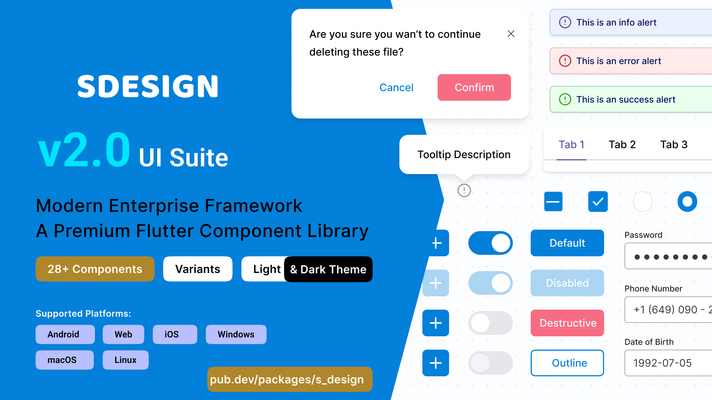

<div align="center">



 ✨ sDesign ✨

**The Fluid, Animated, and Enterprise-Ready UI Component Library for Flutter.**

[](https://pub.dev/packages/s_design)
[]()
[](https://opensource.org/licenses/MIT)

_Zero friction. Infinite customization. Pure flow._

_(The buttery smooth interactions and physics of sDesign)_

[**Launch Live Gallery**](https://frank732.github.io/s_design) • [**Documentation**](#-getting-started) • [**Theming Engine**](#-advanced-theming)

</div>

---

## 💎 Why sDesign?

Forget fighting with rigid boilerplate. **sDesign** is a premium component suite crafted specifically to bring world-class design systems to your Flutter applications effortlessly. We replaced dense setups with visual elegance.

✨ **Animated by Default**  
Every component features liquid-smooth micro-interactions, hover effects, and precise state transitions built directly into the core. Everything feels alive.

✨ **Tokens, not Tears**  
A revolutionary type-safe theming engine (`SThemeData`) that instantly propagates your brand's colors and typography across 20+ complex components seamlessly.

✨ **Pixel-Perfect Rigor**  
Designed with impeccable attention to margin, padding, typography, and optical alignment. It just _looks expensive_.

---

---

## 🧩 The Arsenal

We provide **28+ robust, accessible modules** that seamlessly adapt to all 6 major Flutter platforms (iOS, Android, Web, Windows, macOS, Linux).

| Category        | High-End Components                                                                                                     |
| :-------------- | :---------------------------------------------------------------------------------------------------------------------- |
| **🕹️ Inputs**   | `SButton`, `SInput`, `SSelect`, `SSwitch`, `SDatePicker`, `SSlider`,`SCheckbox`,`SDatePicker`,`STimePicker`,`SDropdown` |
| **🏗️ Layout**   | `SScaffold` (w/ Pull-to-refresh), `SCard`, `STabs`, `SPagination` ,`SListTile`,`SBottom Navigation`                     |
| **💬 Feedback** | `SSonner` (Stackable Toasts), `SAlert`, `SDialog`, `SFloatingPanel`,                                                    |
| **📱 Display**  | `SAvatar`, `SSteps`, `SQRCode`, `SProgress`, `STooltip`, `SAvatar` ,`SSlider`,                                          |

---

## ⚡ Setup in Seconds

We hate boilerplate as much as you do. Wrap your app in `SApp` and let us handle the theming, overlays, localization, and scroll physics automatically.

```dart
// Your entire design system configured in one widget wrapper.
SApp(
  title: 'My Gorgeous App',
  theme: SThemeData.light(),
  darkTheme: SThemeData.dark(),
  home: const MyDashboard(),
)
```

### 🛠️ Alternative Setup (Without `SApp`)

You are not required to use `SApp`. If you prefer using a standard `MaterialApp` or have an existing app structure with your own `ThemeData`, you can still use all `sDesign` components. 

Your existing Material theme will continue to style standard Flutter widgets, while `AnimatedSTheme` will specifically style the `sDesign` components. You just need to initialize the overlays and wrap your app:

```dart
// ============================================================================
// ALTERNATIVE SETUP: Using other AppWrappers instead of SApp
// ============================================================================
MaterialApp(
  title: 'My Existing App',
  theme: ThemeData(
    // 1. KEEP YOUR EXISTING THEME:
    // This handles styling for all standard Flutter widgets (Scaffold, AppBar, etc.)
    // You don't need to throw away your existing material design system!
    colorScheme: ColorScheme.fromSeed(seedColor: Colors.blue),
    useMaterial3: true,
  ),
  builder: (context, child) {
    // 2. WRAP YOUR APP:
    // We inject our own Overlay to ensure that global notifications (Toasts, Sonner)
    // float above everything else, including navigation routes and modals.
    return _OverlayInitializer(child: child!);
  },
  home: const MyDashboard(),
)

// ============================================================================
// OVERLAY & THEME INITIALIZER WIDGET
// ============================================================================
class _OverlayInitializer extends StatefulWidget {
  final Widget child;
  const _OverlayInitializer({required this.child});

  @override
  State<_OverlayInitializer> createState() => _OverlayInitializerState();
}

class _OverlayInitializerState extends State<_OverlayInitializer> {
  // A dedicated key to access our custom overlay state globally
  final GlobalKey<OverlayState> _overlayKey = GlobalKey<OverlayState>();

  @override
  void initState() {
    super.initState();
    WidgetsBinding.instance.addPostFrameCallback((_) {
      if (!mounted) return;
      final overlay = _overlayKey.currentState;
      if (overlay != null) {
        // 3. REGISTER sDESIGN OVERLAYS:
        // Initialize the global overlay systems provided by sDesign.
        // This allows them to be called from anywhere without BuildContext!
        SSonner.initialize(overlay);
        SToast.initialize(overlay);
        
        // If your package adds more global overlays in the future (e.g., SFloatingPanel),
        // register them here as well:
        // SFloatingPanel.initialize(overlay);
        // SGlobalModal.initialize(overlay);
      }
  }

  @override
  Widget build(BuildContext context) {
    // 4. INJECT sDESIGN THEME:
    // AnimatedSTheme is the engine that styles all sDesign components.
    // By wrapping your app here, every SButton, SCard, SInput, etc. gets styled,
    // while standard widgets still use your MaterialApp's ThemeData.
    return AnimatedSTheme(
      data: SThemeData.light(), // Customize colors/typography here
      child: Stack(
        children: [
          // The main application content
          widget.child,
          // The dedicated overlay sitting on top of everything
          Overlay(key: _overlayKey),
        ],
      ),
    );
  }
}
```

---

<!--
<div align="center">
  <h2>The SSonner Notification System 🔔</h2>
  <div style="border-radius: 12px; padding: 40px; border: 2px dashed #444; background: #1a1a1a; color: #888; max-width: 500px; margin: 0 auto;">
    <p style="font-size: 1.2em; margin-bottom: 8px;">✨ <b>[Insert SSonner Toast GIF Here]</b> ✨</p>
    <p style="font-size: 0.9em; margin: 0;"><i>Record the stacking SSonner notifications!</i></p>
  </div>
  <br/>
  <p><i>Gorgeous, physics-based, stackable toast notifications built right into the ecosystem. No messy scaffold messengers.</i></p>
</div> -->

---

## 🌍 Links & Resources

- [Explore the Interactive Web Gallery](https://frank732.github.io/s_design)
- [Design Tokens & Variables](https://frank732.github.io/s_design/tokens)
- [Issue Tracker & Feature Requests](https://github.com/FRANK732/s_design/issues)

<br/>

<div align="center">
  
  <p>Built with ❤️ by <b>Schrift Flow</b></p>
  <p>Licensed under the MIT License.</p>
</div>
